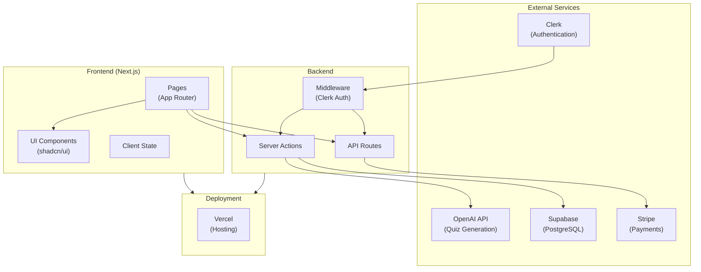

# Architecture Diagram

```mermaid
graph TB
    subgraph Client["Frontend (Next.js)"]
        Pages["Pages<br/>(App Router)"]
        Components["UI Components<br/>(shadcn/ui)"]
        State["Client State"]
    end

    subgraph Server["Backend"]
        SA["Server Actions"]
        API["API Routes"]
        MW["Middleware<br/>(Clerk Auth)"]
    end

    subgraph External["External Services"]
        AI["OpenAI API<br/>(Quiz Generation)"]
        DB["Supabase<br/>(PostgreSQL)"]
        Auth["Clerk<br/>(Authentication)"]
        Pay["Stripe<br/>(Payments)"]
    end

    subgraph Deploy["Deployment"]
        Vercel["Vercel<br/>(Hosting)"]
    end

    Pages --> Components
    Pages --> SA
    Pages --> API
    MW --> SA
    MW --> API
    SA --> DB
    SA --> AI
    API --> Pay
    Auth --> MW
    Client --> Deploy
    Server --> Deploy
```
