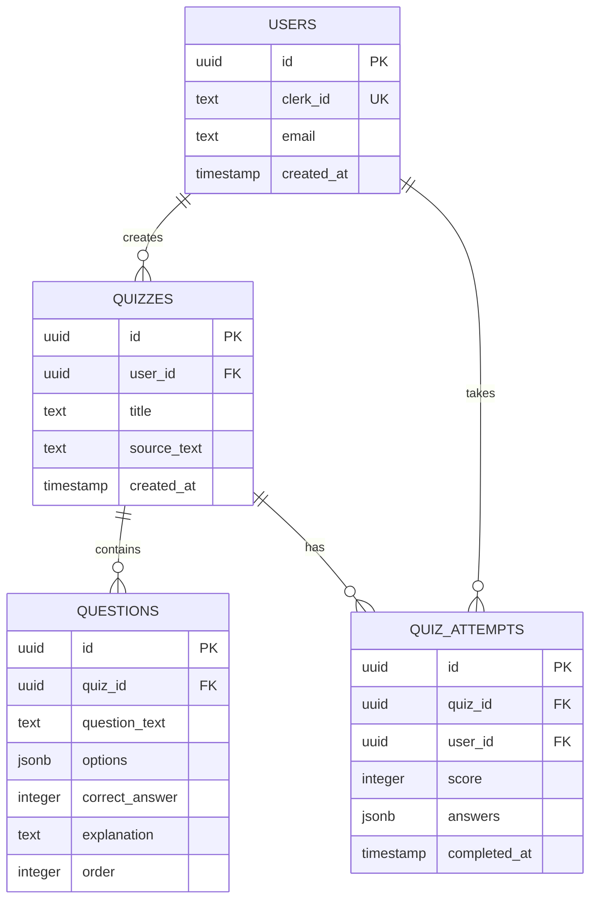

# Database ERD

```mermaid
erDiagram
    USERS {
        uuid id PK
        text clerk_id UK
        text email
        timestamp created_at
    }

    QUIZZES {
        uuid id PK
        uuid user_id FK
        text title
        text source_text
        timestamp created_at
    }

    QUESTIONS {
        uuid id PK
        uuid quiz_id FK
        text question_text
        jsonb options
        integer correct_answer
        text explanation
        integer order
    }

    QUIZ_ATTEMPTS {
        uuid id PK
        uuid quiz_id FK
        uuid user_id FK
        integer score
        jsonb answers
        timestamp completed_at
    }

    USERS ||--o{ QUIZZES : "creates"
    USERS ||--o{ QUIZ_ATTEMPTS : "takes"
    QUIZZES ||--o{ QUESTIONS : "contains"
    QUIZZES ||--o{ QUIZ_ATTEMPTS : "has"
```
