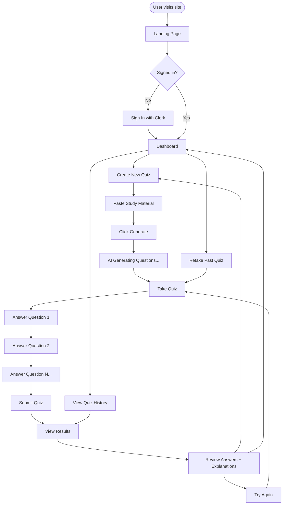

# User Flow Diagram

```mermaid
flowchart TD
    Start([User visits site]) --> Landing[Landing Page]
    Landing --> SignIn{Signed in?}

    SignIn -->|No| Auth[Sign In with Clerk]
    Auth --> Dashboard
    SignIn -->|Yes| Dashboard[Dashboard]

    Dashboard --> NewQuiz[Create New Quiz]
    Dashboard --> History[View Quiz History]
    Dashboard --> Retake[Retake Past Quiz]

    NewQuiz --> Upload[Paste Study Material]
    Upload --> Generate[Click Generate]
    Generate --> Loading[AI Generating Questions...]
    Loading --> Quiz[Take Quiz]

    Quiz --> Q1[Answer Question 1]
    Q1 --> Q2[Answer Question 2]
    Q2 --> QN[Answer Question N...]
    QN --> Submit[Submit Quiz]

    Submit --> Results[View Results]
    Results --> Review[Review Answers + Explanations]

    Review --> TryAgain[Try Again]
    Review --> NewQuiz
    Review --> Dashboard

    TryAgain --> Quiz
    Retake --> Quiz
    History --> Results
```
